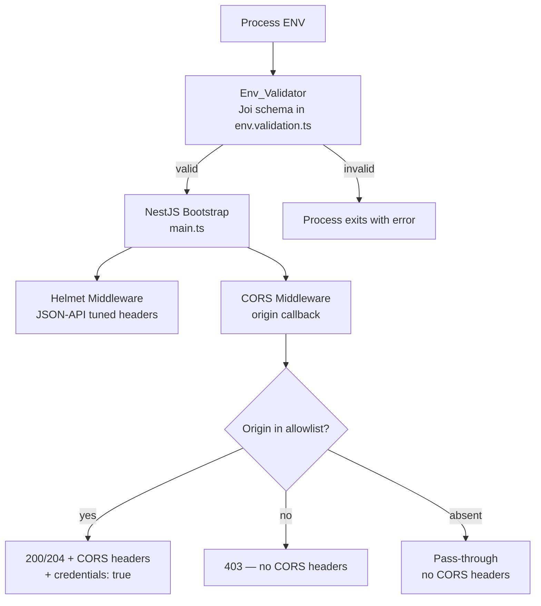

# Design Document: CORS & Helmet Security Headers

## Overview

This design formalises the NestJS backend's browser-facing security configuration by:

1. Replacing the current `CORS_ORIGINS` wildcard-permissive setup with a validated, environment-driven `FRONTEND_ORIGINS` allowlist.
2. Tuning Helmet's HTTP security headers for a JSON-only API (no HTML served).
3. Enforcing that credentials (`Access-Control-Allow-Credentials: true`) are never paired with a wildcard origin.
4. Handling preflight (OPTIONS) flows correctly.
5. Providing automated tests and developer documentation.

The existing `main.ts` already imports `helmet` and has a partial CORS implementation using `CORS_ORIGINS`. This feature replaces that with `FRONTEND_ORIGINS`, adds production-mode validation, and tunes Helmet's defaults.

---

## Architecture

The feature touches three layers of the bootstrap pipeline:



Key design decisions:

- **Startup-time enforcement**: The Joi validator rejects the process before any request is served if the env is misconfigured. This is the cheapest place to catch wildcard-in-production and http-in-production errors.
- **Origin callback (not static string)**: NestJS `enableCors` receives a function so the exact requesting origin is echoed back rather than a static `*`, which is required when `credentials: true`.
- **Helmet before CORS**: Helmet runs first so security headers are always present, even on 403 responses.

---

## Components and Interfaces

### 1. Env_Validator (`backend/src/config/env.validation.ts`)

The Joi schema gains a `FRONTEND_ORIGINS` field and production-mode custom validation:

```
FRONTEND_ORIGINS: required string
  - must be present (no default)
  - custom rule: when NODE_ENV=production, every comma-separated entry must start with https://
  - custom rule: when NODE_ENV=production, no entry may equal '*'
  - when NODE_ENV=development|test, any non-empty string is accepted

ADMIN_CORS_ORIGINS: optional string, default ''
  - no production-mode restriction (admin UI may be internal HTTP)
```

The existing `CORS_ORIGINS` field is removed (or deprecated) in favour of `FRONTEND_ORIGINS`.

### 2. Origin Allowlist Parser (inline utility in `main.ts`)

A small pure function used at bootstrap:

```typescript
function parseOrigins(raw: string): string[] {
  return raw
    .split(",")
    .map((s) => s.trim())
    .filter(Boolean);
}
```

This is intentionally not a separate service — it runs once at startup and has no runtime dependencies.

### 3. CORS Middleware (`main.ts` — `app.enableCors(...)`)

```typescript
app.enableCors({
  origin: (origin, cb) => {
    if (!origin) return cb(null, true); // server-to-server / same-origin
    const allowed = [...frontendOrigins, ...adminOrigins];
    if (allowed.includes(origin)) return cb(null, origin); // echo exact origin
    return cb(new Error("Not allowed by CORS"), false); // triggers 403
  },
  credentials: true,
  methods: ["GET", "POST", "PUT", "PATCH", "DELETE", "OPTIONS"],
  allowedHeaders: ["Authorization", "Content-Type", "X-Requested-With"],
  maxAge: 86400,
  preflightContinue: false,
  optionsSuccessStatus: 204,
});
```

When the origin callback calls `cb(new Error(...), false)`, NestJS/Express CORS middleware responds with HTTP 403 and omits `Access-Control-Allow-Origin`.

### 4. Helmet Middleware (`main.ts` — `app.use(helmet(...))`)

Helmet is called with an explicit options object tuned for a JSON API:

```typescript
app.use(
  helmet({
    contentSecurityPolicy: {
      directives: { defaultSrc: ["'none'"] },
    },
    hsts: {
      maxAge: 31_536_000,
      includeSubDomains: true,
      preload: false,
    },
    frameguard: { action: "deny" },
    dnsPrefetchControl: { allow: false },
    referrerPolicy: { policy: "no-referrer" },
    permittedCrossDomainPolicies: false,
    crossOriginEmbedderPolicy: false, // not relevant for JSON API
    // X-Powered-By is removed by helmet by default
  }),
);
```

`Permissions-Policy` (camera, microphone, geolocation) is set via a custom header since Helmet 7 does not include a built-in `permissionsPolicy` helper:

```typescript
app.use((_req, res, next) => {
  res.setHeader(
    "Permissions-Policy",
    "camera=(), microphone=(), geolocation=()",
  );
  next();
});
```

---

## Data Models

No new database models are introduced. The only "data" is configuration:

| Env Variable         | Type                                      | Required | Validation                                            |
| -------------------- | ----------------------------------------- | -------- | ----------------------------------------------------- |
| `FRONTEND_ORIGINS`   | `string`                                  | yes      | Non-empty; production: all entries `https://`, no `*` |
| `ADMIN_CORS_ORIGINS` | `string`                                  | no       | Default `''`; empty string means no admin origins     |
| `NODE_ENV`           | `'development' \| 'production' \| 'test'` | no       | Default `'development'`                               |

Parsed runtime shape (in-memory only, not persisted):

```typescript
interface CorsConfig {
  frontendOrigins: string[]; // parsed from FRONTEND_ORIGINS
  adminOrigins: string[]; // parsed from ADMIN_CORS_ORIGINS
}
```

---

## Correctness Properties

_A property is a characteristic or behavior that should hold true across all valid executions of a system — essentially, a formal statement about what the system should do. Properties serve as the bridge between human-readable specifications and machine-verifiable correctness guarantees._

### Property 1: Origin list parsing preserves trimmed values

_For any_ array of non-empty strings with arbitrary surrounding whitespace, joining them with commas and passing through `parseOrigins` should produce an array where every element equals the original string with leading/trailing whitespace removed, and no empty strings are present.

**Validates: Requirements 1.1, 1.2, 1.6**

---

### Property 2: Allowed origin is echoed in response

_For any_ non-empty allowlist and any origin that is a member of that allowlist, a request bearing that `Origin` header should receive a response where `Access-Control-Allow-Origin` equals that exact origin string.

**Validates: Requirements 2.1**

---

### Property 3: Disallowed origin is rejected

_For any_ non-empty allowlist and any origin string that is not a member of that allowlist, both regular requests and OPTIONS preflight requests bearing that `Origin` header should receive HTTP 403 with no `Access-Control-Allow-Origin` header.

**Validates: Requirements 2.2, 3.2**

---

### Property 4: Credentials header present for all allowed origins

_For any_ origin in the allowlist, the response to a request from that origin should always include `Access-Control-Allow-Credentials: true`.

**Validates: Requirements 2.4**

---

### Property 5: Allowed-origin response headers completeness

_For any_ origin in the allowlist, the response should include `Access-Control-Allow-Headers` containing `Authorization`, `Content-Type`, and `X-Requested-With`, and `Access-Control-Allow-Methods` containing `GET`, `POST`, `PUT`, `PATCH`, `DELETE`, and `OPTIONS`.

**Validates: Requirements 2.6, 2.7**

---

### Property 6: Preflight response completeness

_For any_ origin in the allowlist, an OPTIONS preflight request should receive HTTP 204 with `Access-Control-Allow-Origin` set to that origin, `Access-Control-Allow-Credentials: true`, and `Access-Control-Max-Age: 86400`.

**Validates: Requirements 3.1, 3.3**

---

### Property 7: Production mode rejects non-HTTPS origins

_For any_ string that contains at least one comma-separated entry starting with `http://` (not `https://`), the Joi validator should reject it when `NODE_ENV` is `production`.

**Validates: Requirements 5.1, 5.2**

---

## Error Handling

| Scenario                              | Behaviour                                                                            |
| ------------------------------------- | ------------------------------------------------------------------------------------ |
| `FRONTEND_ORIGINS` missing at startup | Joi throws; process exits with descriptive message before any port is bound          |
| `FRONTEND_ORIGINS=*` in production    | Joi custom validator throws; process exits                                           |
| Any `http://` origin in production    | Joi custom validator throws; process exits                                           |
| Request from disallowed origin        | CORS callback calls `cb(new Error(...), false)`; Express CORS middleware returns 403 |
| Preflight from disallowed origin      | Same as above — 403, no CORS headers                                                 |
| No `Origin` header                    | CORS callback calls `cb(null, true)`; request proceeds normally                      |

No new exception filters are needed — the existing `HttpExceptionFilter` handles 403 responses correctly.

---

## Testing Strategy

### Dual Testing Approach

Both unit/integration tests and property-based tests are used. They are complementary:

- **Integration tests** (Jest + Supertest): verify specific examples, edge cases, and the full HTTP stack including Helmet headers.
- **Property-based tests** (Jest + `fast-check`): verify universal properties across randomly generated inputs, catching edge cases that hand-written examples miss.

`fast-check` is the property-based testing library for TypeScript/JavaScript. It integrates directly with Jest via `fc.assert(fc.property(...))` and requires no additional test runner.

Install: `npm install --save-dev fast-check`

### Test File Layout

```
backend/src/__tests__/
  cors.test.ts          # integration tests (Supertest against real NestJS app)
  cors.property.test.ts # property-based tests (fast-check, no HTTP needed)
```

### Integration Tests (`cors.test.ts`)

These spin up the NestJS application with a controlled `FRONTEND_ORIGINS` env and use Supertest:

1. Allowed origin → `Access-Control-Allow-Origin` equals that origin (Req 6.1)
2. Disallowed origin → no `Access-Control-Allow-Origin` header (Req 6.2)
3. Preflight from allowed origin → 204 + correct headers (Req 6.3)
4. Preflight from disallowed origin → 403 (Req 6.4)
5. No `Origin` header → request succeeds (Req 6.5)
6. Allowed origin → `Access-Control-Allow-Credentials: true` (Req 6.6)
7. Helmet headers example: single request asserts all 7 required headers are present and `X-Powered-By` is absent (Req 4.1–4.8)

### Property-Based Tests (`cors.property.test.ts`)

Each test runs a minimum of 100 iterations. Tests do not require HTTP — they test pure functions (the parser) and the CORS origin callback logic directly.

```
// Feature: cors-helmet-security-headers, Property 1: origin list parsing preserves trimmed values
fc.assert(fc.property(
  fc.array(fc.string({ minLength: 1 }).map(s => `  ${s}  `)),
  (origins) => { ... }
), { numRuns: 100 });
```

| Test                          | Property   | Tag                                                 |
| ----------------------------- | ---------- | --------------------------------------------------- |
| Origin list parsing           | Property 1 | `Feature: cors-helmet-security-headers, Property 1` |
| Allowed origin echoed         | Property 2 | `Feature: cors-helmet-security-headers, Property 2` |
| Disallowed origin rejected    | Property 3 | `Feature: cors-helmet-security-headers, Property 3` |
| Credentials header present    | Property 4 | `Feature: cors-helmet-security-headers, Property 4` |
| Response headers completeness | Property 5 | `Feature: cors-helmet-security-headers, Property 5` |
| Preflight completeness        | Property 6 | `Feature: cors-helmet-security-headers, Property 6` |
| Production rejects http://    | Property 7 | `Feature: cors-helmet-security-headers, Property 7` |

Each correctness property is implemented by exactly one property-based test.

### Unit Tests for Env Validator

Separate unit tests for the Joi schema cover the edge-case examples:

- Missing `FRONTEND_ORIGINS` → error (Req 1.3)
- `FRONTEND_ORIGINS=*` in production → error (Req 1.4)
- `FRONTEND_ORIGINS=http://localhost:3001` in development → valid (Req 1.5)
- `FRONTEND_ORIGINS=http://example.com` in production → error (Req 5.2)
